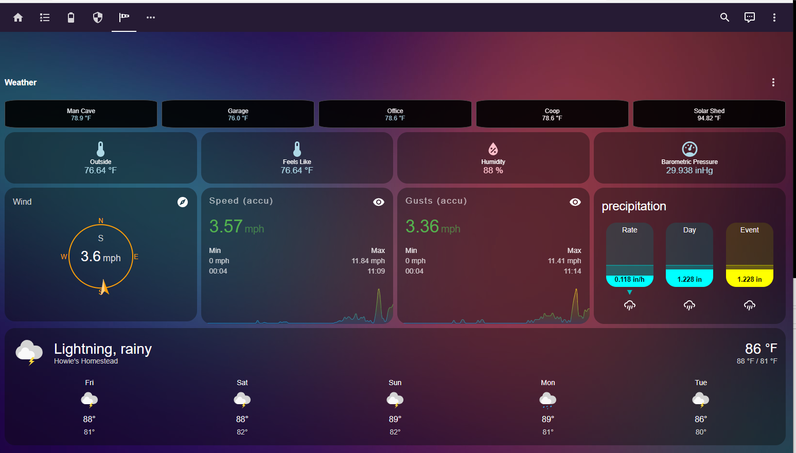
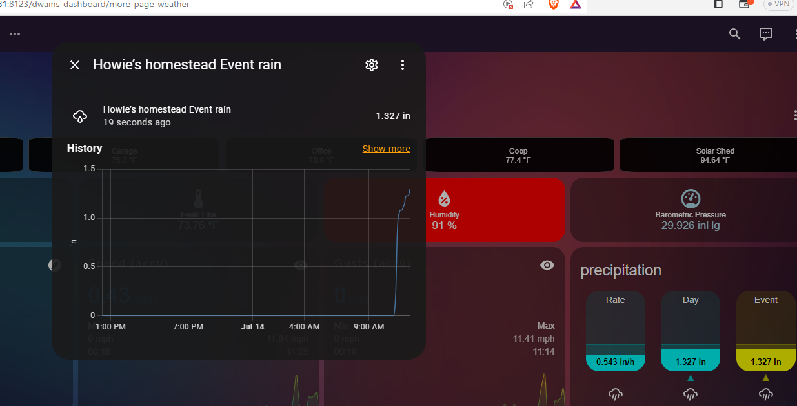
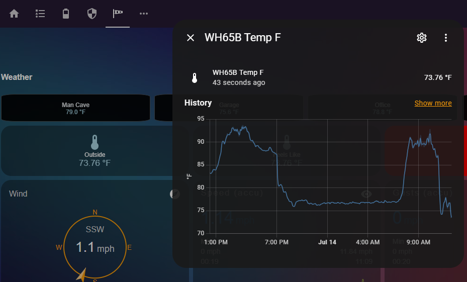

# Home_Assistant_Weather_Page
A nice Lovelace page to display the weather station and custom sensors on Home Assistant

# Information: 

I have been playing with Dwains Dashboard, and wanted to put together a simple "weather" page which 
collected all my mqtt data from my Ambient Weather Station and displayed it on a page. 
On the page, I also wanted to see (at a glance) all the differnet temperatures in differnet locations, 
and based on values, display colors, and even blink if necessary. 

Here is a screenshot from what my page looks like. 
Note, on this snapshot, it was a rainy afternoon, but very hot/humid. 
This is the second set of showers, so the event gauges ar working properly. 

The Weather Dashboard:

A couple of shot of the details of sensor - 
First, the rain details

Next, the outside temp - wow, it really drops when the rain starts. 

# Files and Here. 

In my case, using Dwain's dashboard, that is my dependency. 
However, this code can be used as a simple page inside Lovelace with minumal modifications. 
There are a few custom cards, which if you don't have them already, you should get them through HACS. 

I have uploaded the YAML files accordingly

# Sources. 

I have multiple sources of data for this page (not all shown in this repository). 

In most cases, I have different zigbee weather sensors on the doors, etc. 
You don't really need to know which ones, as any of them will work. 

The next is data from my weather station (code not here, but it is nice to know the current information on my dashboard). 
I get all that data from another raspi using rtl433 receiver (listening on 900 mhz I believe). 

I'm going to eventually put the whole set of code, and complete description of what I did to get here, but for now, 
this should be enough for the folks who asked me for the information. 

